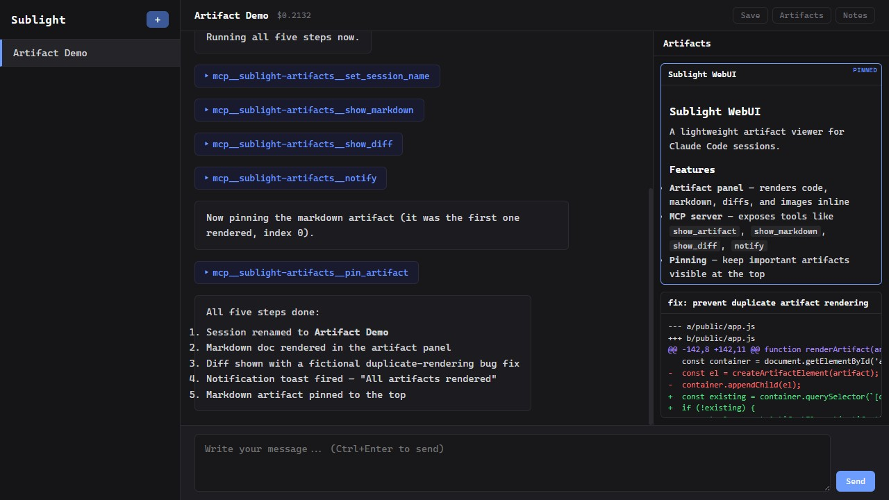
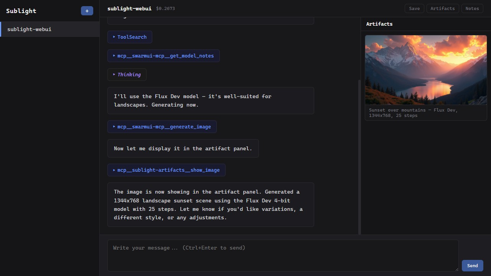

# Sublight WebUI

A lightweight, self-hosted web interface for [Claude Code](https://claude.com/product/claude-code). Wraps persistent CLI sessions with a multi-session chat UI, artifact panel, and custom MCP tools.

**This is a personal project, not a product.** It is not affiliated with, endorsed by, or commercially connected to Anthropic. It does not use the Claude API — it spawns the unmodified `claude` CLI binary that you install and authenticate yourself. No OAuth tokens are extracted, intercepted, or proxied. No credentials are captured or stored. It's a web-based terminal wrapper, not an API client.





## How It Works

```
Browser <--WebSocket--> Sublight Server <--stdin/stdout--> Claude CLI (persistent)
                              |                                  |
                              +<-- POST /artifact --<-- MCP artifact server
```

Sublight is a local process wrapper, not an API client. Each session spawns **one persistent Claude process** using `--input-format stream-json --output-format stream-json`. Messages are written to stdin, responses stream from stdout. The process stays alive across turns — no context reload, no re-spawn.

A custom MCP server (`artifact-mcp.js`) is injected via `--mcp-config` alongside your existing project/global MCP servers. It gives Claude tools to push artifacts, images, diffs, and notifications to the browser.

**You must have the Claude CLI installed and authenticated before using Sublight.** This tool does not handle authentication — it relies entirely on your local `claude` installation and whatever subscription or credentials you've already configured.

## Quick Start

```bash
npm install
npm start
```

Open `http://localhost:3700` in your browser. On first run, a setup screen will generate an access token and let you configure security defaults.

## Configuration

Settings are managed through the in-app Settings dialog. You can also set environment variables in `.env`:

```bash
# Access token (auto-generated on first run if not set)
SUBLIGHT_TOKEN=your-secret-here

# Bind address (default: 127.0.0.1, localhost only)
HOST=127.0.0.1

# Port (default: 3700)
PORT=3700
```

## Features

### Sessions
- Multiple concurrent sessions, each with its own Claude process
- Working directory per session (with filesystem autocomplete)
- Sessions survive browser refresh — reconnect to running processes
- Rename sessions (double-click in sidebar)
- Export as markdown or full bundle (transcript + artifacts + raw log)
- Session logs saved as NDJSON in `logs/`

### Chat
- Multi-line input (Enter = newline, Ctrl+Enter = send)
- Streaming responses with markdown rendering and syntax highlighting
- Collapsible thinking blocks and tool use cards with subagent nesting
- File attachments: click +, Ctrl+V paste screenshots, or drag-and-drop images
- Multimodal — attached images sent to Claude as base64 for vision analysis
- Command palette (Ctrl+K) for quick session switching

### Artifact Panel
Claude has 9 MCP tools to push content to a side panel:

| Tool | Purpose |
|---|---|
| `show_image` | Display local image files |
| `show_artifact` | Code/text with syntax highlighting |
| `show_markdown` | Full markdown documents |
| `show_diff` | Color-coded unified diffs |
| `show_progress` | Animated progress bar |
| `notify` | Toast notification |
| `open_url` | Open URL in new tab (with user confirmation) |
| `pin_artifact` | Pin artifacts to top of panel |
| `set_session_name` | Rename the session |

Artifacts are individually exportable (hover to reveal Save button).

### Notes
- Per-session scratch space (Notes panel)
- Multiple note cards per session, auto-saved to localStorage
- Not sent to Claude — private working memory for the user

## Security

**This is a local development tool, not a production web application.** Security defaults are restrictive (localhost-only, auth required, file scoping enabled), but understand these characteristics:

- **Sessions inherit your global Claude config.** Sublight spawns the `claude` CLI as a child process, so whatever MCP servers, plugins, hooks, and permissions live in your `~/.claude.json` come along. If Claude is authorized to do something in your terminal, it can do it from a Sublight session.

- **Per-session permission mode.** The new-session dialog lets you choose between "skip permission prompts" (`--dangerously-skip-permissions`) and the default restricted mode.

- **File serving is scoped by default.** The `/local-file` endpoint (used for artifact image display) is restricted to image extensions, requires auth, and is scoped to active session directories. Path traversal is blocked unconditionally.

- **Single shared token for auth.** Not a multi-user system. Anyone with the token has full access to all sessions.

- **No TLS.** Runs plain HTTP/WS. Use a reverse proxy with TLS if exposing beyond localhost.

### Known Limitations

- **Non-bypass sessions hang on permission prompts.** Claude Code's interactive permission flow expects a terminal. Use "skip permission prompts" or configure an allowed-tools list when creating a session.

- **Sessions are in-memory but logs persist.** Server restarts drop active sessions. NDJSON transcripts in `logs/` remain and can be resumed.

### Recommended Deployment

For local-only use (single machine):
```bash
HOST=127.0.0.1
```

For LAN access (trusted network):
```bash
HOST=0.0.0.0
SUBLIGHT_TOKEN=a-strong-random-token
```

Do not expose to the public internet without a reverse proxy, TLS, and additional access controls.

## Requirements

- Node.js 18+
- [Claude CLI](https://docs.anthropic.com/en/docs/claude-code) installed and authenticated
- Claude CLI must be in PATH

## Legal

This project is not affiliated with, endorsed by, or supported by Anthropic, PBC. "Claude" and "Claude Code" are trademarks of Anthropic. Sublight wraps the locally-installed Claude CLI binary — it does not access the Claude API, extract OAuth tokens, or proxy subscription credentials. Users are responsible for complying with Anthropic's [Consumer Terms of Service](https://www.anthropic.com/legal/consumer-terms) and [Usage Policy](https://www.anthropic.com/legal/aup).

This software is provided under a proprietary license. See [LICENSE](LICENSE) for details.

## Development

```bash
npm run dev    # auto-restart on file changes
npm test       # run test suite (27 tests)
```

## File Structure

```
sublight-webui/
├── server.js           # Express + WebSocket server, persistent process management
├── artifact-mcp.js     # MCP server with 9 tools for browser artifact display
├── lib/logMeta.js      # NDJSON log parser
├── public/
│   ├── index.html      # SPA shell
│   ├── app.js          # Frontend logic (sessions, streaming, artifacts, attachments)
│   ├── style.css       # Dark theme
│   └── vendor/         # Vendored libraries (see vendor/LICENSES.md)
├── tests/              # Unit + integration + WebSocket tests
├── assets/             # Screenshots for README
├── logs/               # Per-session NDJSON logs (gitignored)
├── .env.example        # Configuration reference
└── package.json
```
